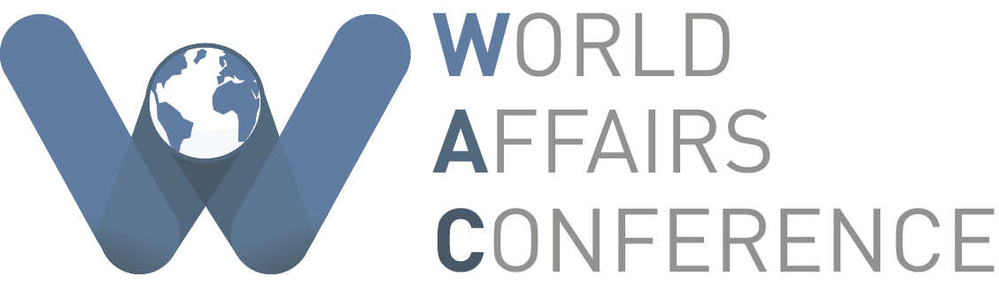

# Conference Logos

Like any other event, WAC has a logo - one that's easy to spot, recognizable, and conveys the message of WAC. The WAC Logo \(and its uses\) are a key part of our design: they're everywhere, on the website, promotional materials, and on things we give to delegates and speakers! Therefore, it's important to know how to use our logo - and how not to!

## Minimal Logo

This is, in a nutshell, WAC's Logo. By itself, it's visually distinct, and it has a noticeable shape and colour - which makes it easy to spot!

When using this logo, try not to mess with its colours or proportions - you shouldn't need to, and it'll interfere with consistency. But, you can resize it as much as you want: its lack of text and crisp, clean edges mean that it can be used at any size.

In addition, notice that it doesn't say "World Affairs Conference" on it - so while it's a good logo, you shouldn't use it if there's no accompanying text and the reader has no context that the logo is for WAC. While this might seem minor, it's important to keep in mind, as decisions like these separate mediocre design from great design.

### Black and White Version

This is a monochrome, black and white version of the minimal logo. This is useful when the material is being made in only one colour \(e.g. pens, cutting down on costs\).

## Full Logo

This is essentially the minimal logo accompanied with "World Affairs Conference". This logo has a more formal connotation, and is easily understood if the viewer is unfamiliar with the conference. However, it's less compact, and the text means that the logo shouldn't be shrunk \(or else the text becomes unreadable\)!
