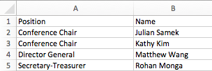
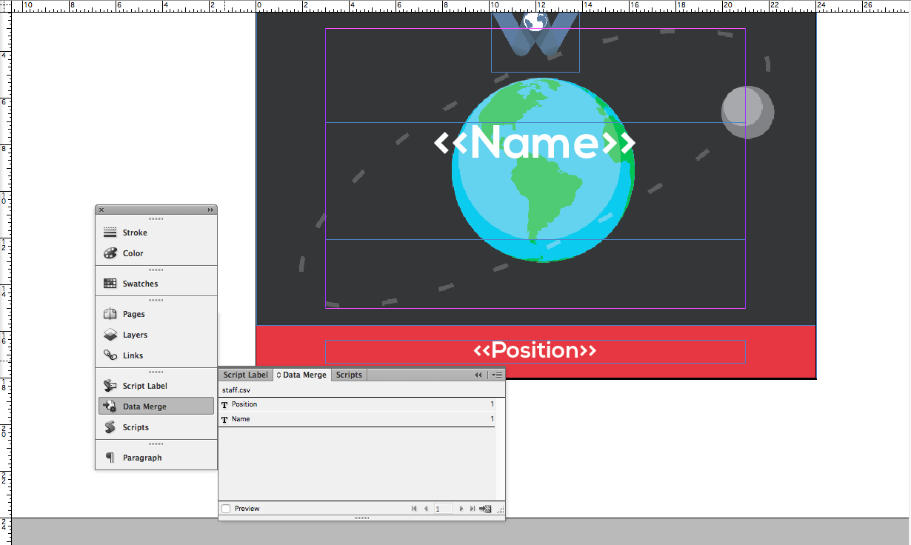
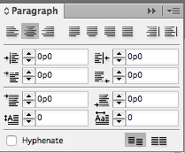

# Nametags

## Overview

We print three different kinds of nametags: delegate nametags, which are double-sided and have each delegate's information on them, faculty nametags, which are single-sided and have just the school name, and staff nametags, which are also single-sided and have the staff position.

All of the nametags are templated in InDesign, generated with Data Merge, and then exported to PDF and printed. Nametag design is relatively simple \(as they don't change year by year and most of the heavy lifting comes from computing\), but it's important to look out for edge cases, such as spelling errors, non-Unicode characters, and cutoff text.

While making the nametags can be arduous, those who are experienced with InDesign can make them very quickly. As such, nametags tend to be a one-person job - but that one person needs to have a basic understanding of coding \(to collect the data\) as well as an eye for design \(to make and produce the nametags\).

## Examples

## Data Collection

Before any designing can be done, all the data for the nametags needs to be centralized into one file. Typically, registration information from WAC is sprawled across different sources \([our registration system](https://github.com/worldaffairsconference/donna), emails, UCC and BH, etc.\). Assembling together all of this information by hand is glaringly inefficient \(and often leads to mistakes\); thus, the best way to ensure that all the files are formatted correctly and put all into one place is through the magic of computers!

This page won't delve too deep into the specifics \(as the process will vary from year to year\), but typically data collection consists of a few lightweight scripts \(in a language like Python\) that pull data from all of the different sources, format them, and validate each of the sources. Then, they assign the plenaries for each delegate, and export all the required data to an output CSV \(ready to use with InDesign\). You can find some sample code we've used in previous years in the [WAC scripts repository](https://github.com/worldaffairsconference/scripts).

### A Quick Note On Plenary Assignments

Assigning plenaries to delegates tends to be a headache, especially with the restrictions that speakers and facilities can put on plenaries. In the past, we've had hiccups every year when programatically assigning plenaries, but the error rate has gone down and down. In theory, it is perfectly possible to write a program that correctly assigns all plenaries - we suggest that future WAC programmers keep on iterating on the scripts we use at WAC.

As a reminder, unless the structure of WAC registration changes, delegates receive 4 preference slots and are assigned three plenaries. As each plenary exists in two timeslots and are paired \(e.g. 2 plenaries are in the first and second timeslot, 2 plenaries are in the first and third timeslot, and 2 plenaries are in the second and third timeslot\), every delegate should receive a set of assignments that is within their preferences.

The challenge tends to come with balancing room numbers and fire codes - often times one plenary at WAC is overwhelmingly more popular than others, which leads into logistics issues. We recommend that you solve this problem outside of code \(e.g. putting popular plenaries in big venues\), but if you must solve it with code then you have to have situations where delegates' preferences aren't met.

## Data Merge

Data Merge is a powerful tool in Adobe InDesign that allows you to create a template file and export many copies of that file, with data populated from an input source. We use Data Merge to generate our nametags from information in an excel spreadsheet.

### File Type

To use Data Merge, the input file needs to have the right file type. We recommend using either Comma Separated Values `.csv` file \(which can be exported from Excel or Google Sheets\), or a UTF-16 Unicode Text `.txt` file \(which can be exported from Excel\). Usually, a CSV is fine, but if the nametag values contain special characters \(e.g. é, ç, ü\) then you must use UTF-16 Unicode encoding to maintain the special characters.

### Format

Data Merge interprets different types of values \(e.g. School, Name, Position\) by a header row, where each column is a specific type of data.

Then, select the Data Merge option in InDesign, and use "Select Data Source" to select your data. The resulting menu should show each of the data types you had.

### Layout

To use these data types, simply create text boxes and type in `<<Type Name>>` . You can also double-click the data type in the Data Merge menu to automatically put it into the document. This text is manipulatable like any other text.

While designing layouts using Data Merge, keep in mind the length of the possible data values: for long data such as delegate or school names, sufficient space is needed to allow the text to wrap into multiple lines. If not, some names will be cut off, which isn't fun for anybody!

If space allows, we suggest that you turn off hyphenation for text blocks, as they can be visually jarring and confusing. You can do this in the paragraph menu.

### Generating and Exporting

You can preview how a generated document by selecting "Preview", or use "Create Merged Document" to create an InDesign document with a spread for each set \(row\) of your data.

To create a final document to print, click "Export to PDF". The wide majority of settings are unimportant, though there are a few tidbits that are:

- Enable "Generate Overset Text Report" - this allows you to see if there's any overset text
- Use Single Record per Document Page, as our document is set up for one nametag per spread.
- Merge All Records - there's no reason not to!
- The "High Quality Print" Preset is usually sufficient, though you can fiddle around with the settings if needed.

After exporting, you should have a PDF that you can send to print. We suggest that you take a cursory look through some of the nametags, just to be sure that there aren't any problems.
