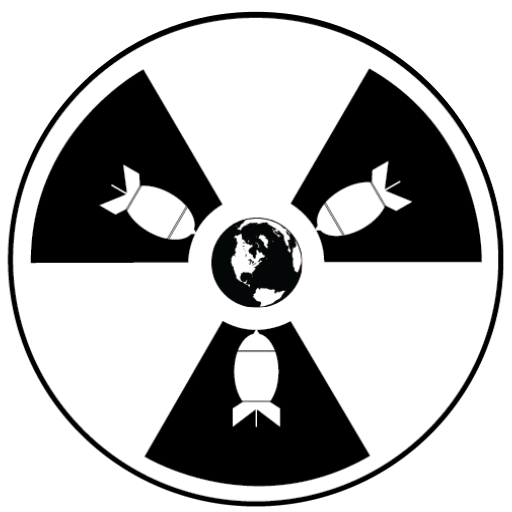
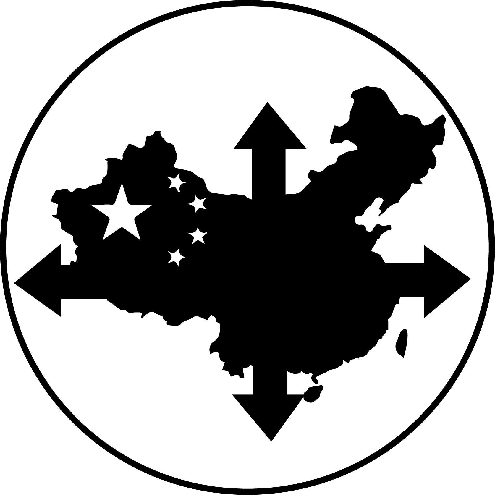
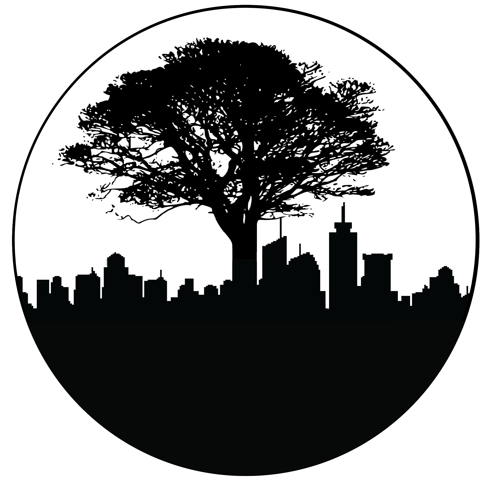

# Program Logos

For each program \(Keynote, Addresses/Panels, and Plenaries\) at WAC, we design an accompanying logo to visually convey the message of the program and to embellish other program-related designs. These logos should be as simple as possible while still properly representing the program.

These logos should be created in Illustrator, as we'll often use them as `.svg` files and we'll be constantly resizing them to fit our various different needs. The logos should be black and white \(though we might play around with the colours on different types of media\). While there's no hard-and-set size, ideally each logo is clearly defined at `64px` and is still sharp at `512px`.

Usually, making Program Logos at WAC is a multi-person job, as you'll need to make about 9 logos in a very short span of time. However, having multiple logo-makers also has its downsides - often times, it means that there is little visual consistency across all of the logos. The largest issue with designing these logos is the time crunch to push them out - as plenaries are only finalized very close to the opening of registration. Ideally, WAC finalizes its plenaries early and then pushes them out to designers.

## Examples

Admittedly, all of these examples need work - this is an area of WAC that could use lots of improvement.

