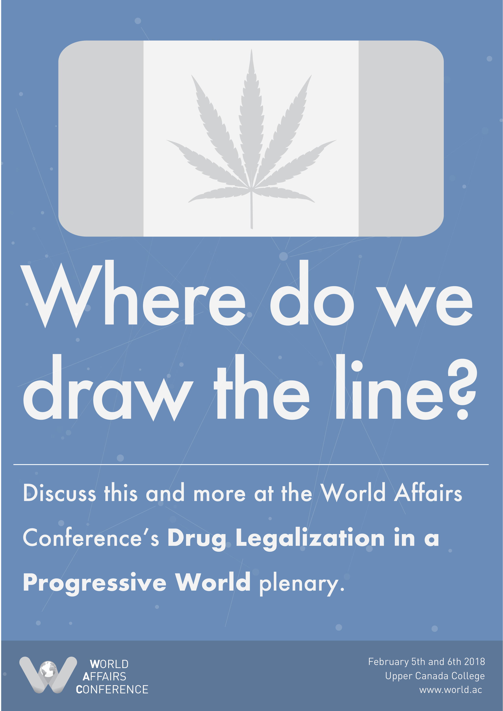
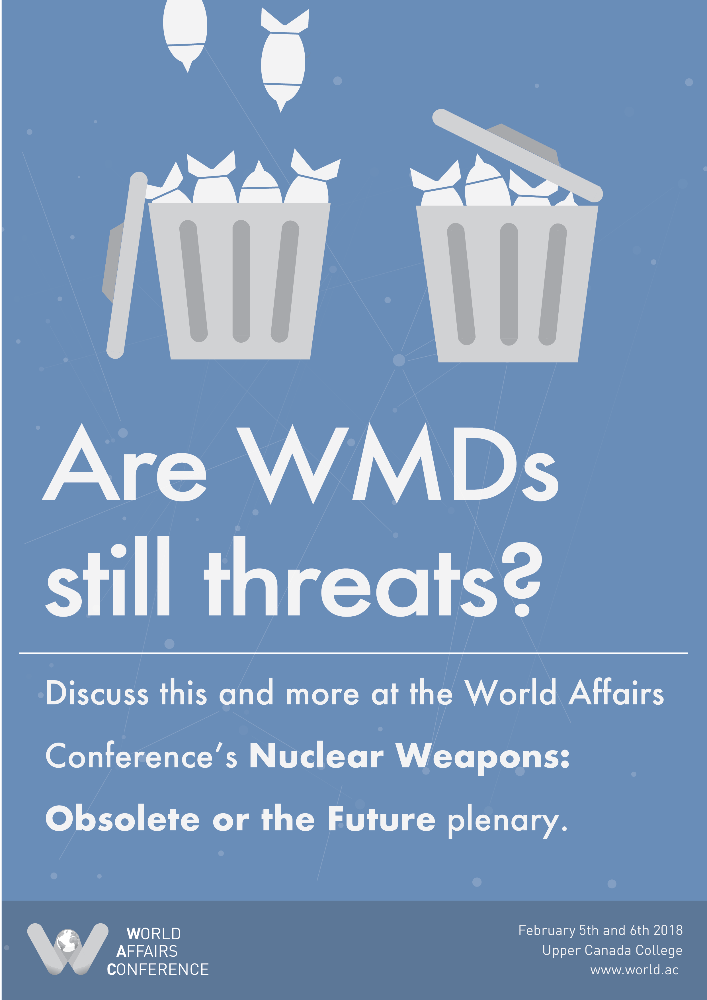
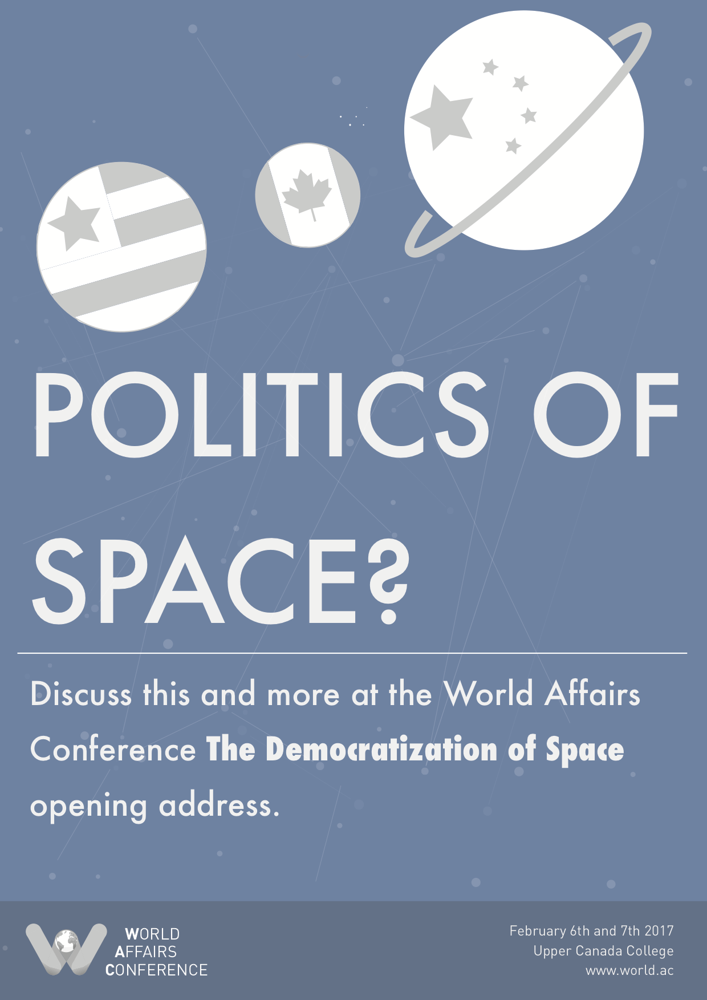
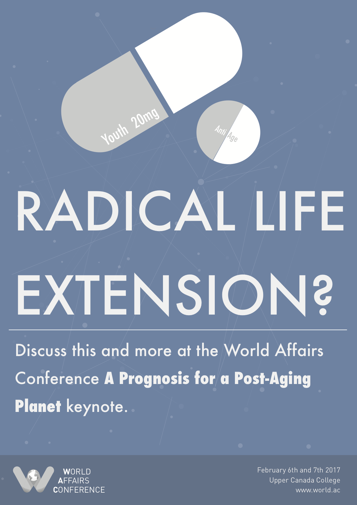
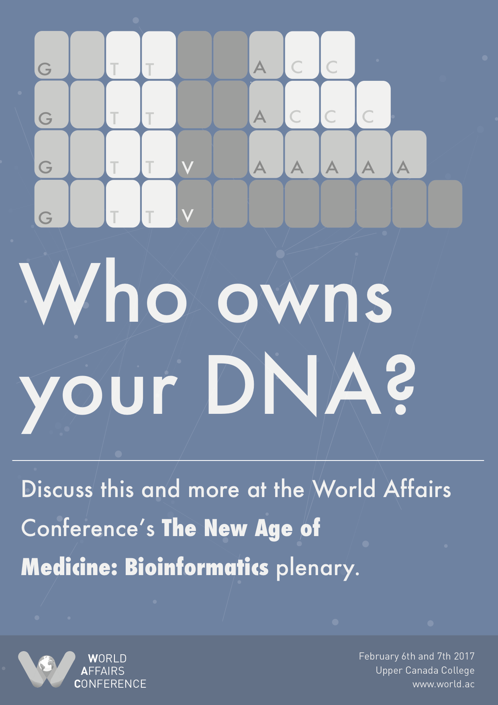

# Program Posters

To advertise each program \(Keynote, Addresses/Panels, Plenaries\) we create posters that showcase the program and pose questions to the audience. These posters should inform the audience about the focus of the programming at WAC, and encourage them to come. We use these posters both physically \(putting them up in UCC and BH\) and digitally \(putting them up on social media\).

Posters can be any size and can be made in any program that the designer is comfortable with, though in the past WAC Program Posters have been made in Photoshop and Illustrator and are typically 13" by 19" - a size that is the most "bang for the buck" for printing at the print shop. However, we recommend experimenting if it makes a better poster!

## Examples

These examples tend to be eye-catching and controversial - perfect for enticing viewers to attend our conference!

